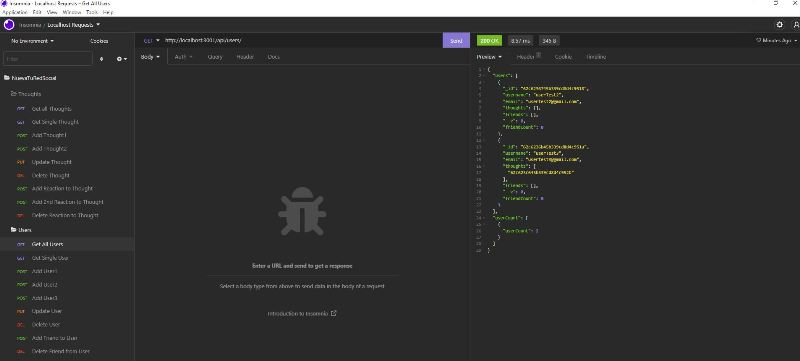

# NTRS-Nueva Tu Red Social
  

  ## Description
  
  - The purpose of this homework assignment was to build an API for a social network web application where users can share their thoughts, react to friends' thoughts, and create a friend list. 
  - I built the back end from scratch and by completing this assignment, I was able to implement lessons from my course, including:
    - Configured a working Express.js API
    - Used Mongoose ODM to interact with a NoSQL database
    - Followed the MVC paradigm to structure my files.
    - Established Express.js routes to deploy the application
  - See the Usage section for a link to a walkthrough video demonstrating the application's functionality using Insomnia
    
    
  The following is a screenshot of all the server routes as seen in Insomnia.   

    
   
   
  ## Table of Contents
   
  - [Installation](#installation)
  - [Usage](#usage)
  - [Credits](#credits)
  - [License](#license)
  - [How To Contribute](#how_to_contribute)
  - [Tests](#tests)
  - [Questions](#questions)
  
  ## Installation
  
  To use this application, there are a few steps to folllow:
  1) Have [NODE.js](https://nodejs.org/en/download/) installed on your computer. 
  2) Clone my [GitHub](https://github.com/CM-GDev/NTRS-NuevaTuRedSocial) repo for this application.
  3) From the root of your project folder and from the command-line, run "npm i" to install the required npm packages for the application
  
  ## Usage
  
  After installing the items above, use this [Walkthrough](https://youtu.be/pJVwoOdp19E) video as a guide for using this application. 
    
  ## Credits

  For this homework assignment, I relied on the documentation for [Mongoose ](https://mongoosejs.com/docs/guide.html)  
  
  ## License
  
  MIT License

  Copyright (c) [2022] [Cristobal Marquez-Glynn]
  
  ## How to Contribute
  
  - [Contributor Covenant](https://www.contributor-covenant.org/) 
  - I'm open to suggestions on how to improve this product.
  
  ## Tests
  
  N/A
  
  ## Questions
   
  For any questions, you can reach me through my [GITHUB](https://github.com/CM-GDev) or email: cristobalmqz@gmail.com account. 
